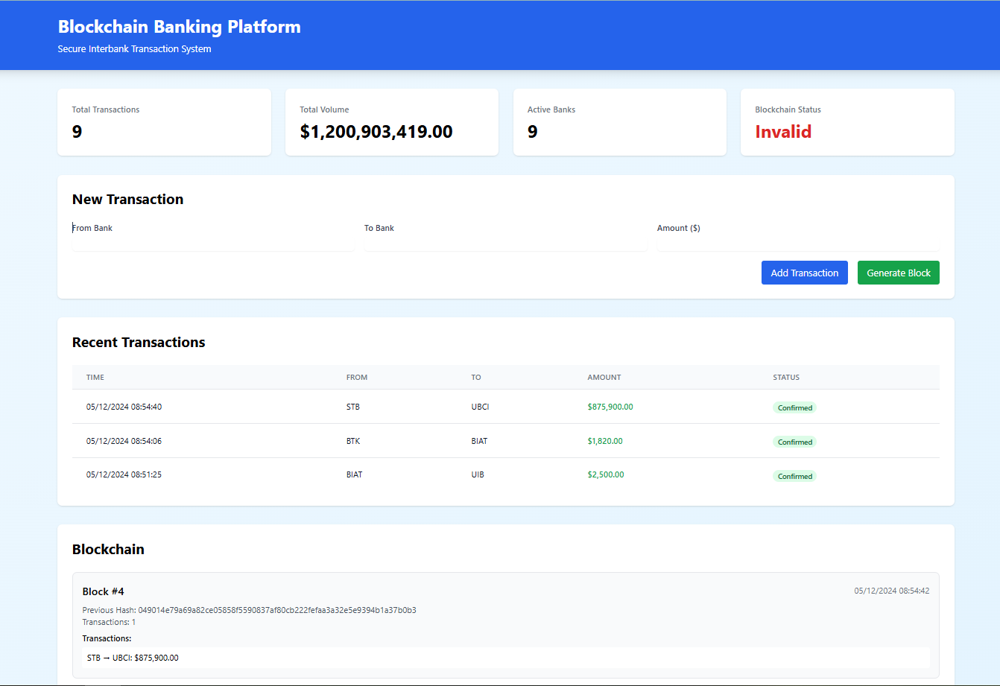

# Blockchain-Based Interbank Transaction Platform

A modern blockchain implementation for secure and transparent interbank transactions. This project provides both a command-line interface and a web interface for managing blockchain transactions between banks.

## 🚀 Features

- ✨ Modern web interface with real-time updates
- 🔒 Secure blockchain implementation
- 💳 Interbank transaction management
- 📊 Transaction history and analytics
- 🔍 Block explorer with detailed view
- 📱 Responsive design for all devices
- 🗄️ SQLite database for persistence

## 📸 Screenshots

### Main Interface



## 🛠️ Technology Stack

- **Backend**: Python 3.9+, Flask
- **Frontend**: HTML5, Tailwind CSS, JavaScript
- **Database**: SQLite3
- **Security**: SHA-256 hashing, Proof of Work
- **Testing**: Pytest

## 📋 Prerequisites

- Python 3.9 or higher
- pip (Python package manager)
- Git

## 🔧 Installation

1. Clone the repository:
```bash
git clone https://github.com/Bechir-Mathlouthi/blockchain-interbank.git
cd blockchain-interbank
```

2. Create and activate virtual environment:
```bash
# Windows
python -m venv venv
venv\Scripts\activate

# Linux/macOS
python3 -m venv venv
source venv/bin/activate
```

3. Install dependencies:
```bash
pip install -r requirements.txt
```

## 🚀 Running the Application

### Web Interface

1. Start the Flask server:
```bash
cd src/webapp
python app.py
```

2. Open your browser and navigate to:
```
http://localhost:5000
```

### Command Line Interface

Run the CLI version:
```bash
python src/main.py
```

## 💻 Usage

### Web Interface

1. **Add Transaction**:
   - Fill in sender bank details
   - Fill in receiver bank details
   - Enter transaction amount
   - Click "Add Transaction"

2. **Generate Block**:
   - Click "Generate Block" to mine pending transactions

3. **View Blockchain**:
   - See all blocks and transactions
   - Monitor blockchain status
   - Track transaction history

### CLI Interface

1. Choose from the menu options:
   - Add new transaction
   - Generate block
   - View blockchain
   - Validate chain

## 🧪 Testing

Run the test suite:
```bash
python -m pytest tests/
```

## 📁 Project Structure

```
blockchain-interbank/
├── src/
│   ├── blockchain.py     # Core blockchain implementation
│   ├── utils.py         # Database utilities
│   ├── main.py         # CLI application
│   └── webapp/         # Web interface
│       ├── app.py     # Flask application
│       ├── templates/ # HTML templates
│       └── static/   # CSS, JS, and other assets
├── tests/
│   └── test_blockchain.py
├── data/              # Database storage
├── requirements.txt   # Python dependencies
└── README.md
```

## 🔐 Security Considerations

This is a demonstration project. For production use, consider:
- Implementing digital signatures
- Adding user authentication
- Using a production-grade database
- Implementing a distributed network
- Adding proper error recovery
- Enhancing security measures

## 🤝 Contributing

1. Fork the repository
2. Create your feature branch (`git checkout -b feature/AmazingFeature`)
3. Commit your changes (`git commit -m 'Add some AmazingFeature'`)
4. Push to the branch (`git push origin feature/AmazingFeature`)
5. Open a Pull Request

## 📝 License

This project is licensed under the MIT License - see the [LICENSE](LICENSE) file for details.

## 👥 Authors

- [Bechir Mathlouthi](https://github.com/Bechir-Mathlouthi) - Initial work

## 🙏 Acknowledgments

- Blockchain technology
- Flask framework
- Python community
